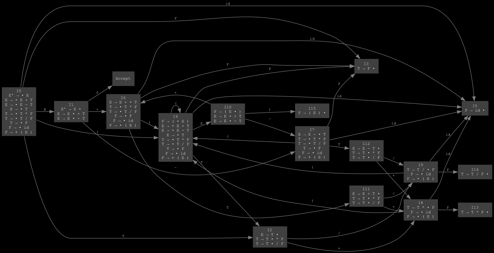

## SLR(1) Парсер для арифметических выражений

**Синтаксический анализ простого "арифметического" языка.**

## Описание

Учебный проект, реализующий **SLR(1) парсер** для арифметических выражений. Проект демонстрирует принципы работы лексического и синтаксического анализа при компиляции.

## Расширенная грамматика:

### E' → E
### E → E + T
### E → E - T
### E → T
### T → T * F
### T → T / F
### T → F
### F → id
### F → ( E )

## Функции FIRST и FOLLOW:

### FIRST(E) = { id, ( }
### FIRST(T) = { id, ( }
### FIRST(F) = { id, ( }

### FOLLOW(E) = { $, ), +, - }
### FOLLOW(T) = { $, ), +, -, *, / }
### FOLLOW(F) = { $, ), +, -, *, / }

##  LR(0) автомат

## Таблицы:

## GOTO

| Состояние | E | T | F |
|:---------:|:--:|:--:|:--:|
| 0 | 1 | 2 | 3 |
| 1 |   |   |   |
| 2 |   |   |   |
| 3 |   |   |   |
| 4 | 10 | 2 | 3 |
| 5 |   |   |   |
| 6 |   | 11 | 3 |
| 7 |   | 12 | 3 |
| 8 |   |   | 13 |
| 9 |   |   | 14 |
| 10 |   |   |   |
| 11 |   |   |   |
| 12 |   |   |   |
| 13 |   |   |   |
| 14 |   |   |   |
| 15 |   |   |   |

## ACTION

| Сост | id | + | - | * | / | ( | ) | $ |
|:----:|:--:|:--:|:--:|:--:|:--:|:--:|:--:|:--:|
| 0 | s5 |   |   |   |   | s4 |   |   |
| 1 |   | s6 | s7 |   |   |   |   | acc |
| 2 |   | r3 | r3 | s8 | s9 |   | r3 | r3 |
| 3 |   | r6 | r6 | r6 | r6 |   | r6 | r6 |
| 4 | s5 |   |   |   |   | s4 |   |   |
| 5 |   | r7 | r7 | r7 | r7 |   | r7 | r7 |
| 6 | s5 |   |   |   |   | s4 |   |   |
| 7 | s5 |   |   |   |   | s4 |   |   |
| 8 | s5 |   |   |   |   | s4 |   |   |
| 9 | s5 |   |   |   |   | s4 |   |   |
| 10 |   | s6 | s7 |   |   |   | s15 |   |
| 11 |   | r1 | r1 | s8 | s9 |   | r1 | r1 |
| 12 |   | r2 | r2 | s8 | s9 |   | r2 | r2 |
| 13 |   | r4 | r4 | r4 | r4 |   | r4 | r4 |
| 14 |   | r5 | r5 | r5 | r5 |   | r5 | r5 |
| 15 |   | r8 | r8 | r8 | r8 |   | r8 | r8 |

## Обозначения:
- **s#** - shift в состояние #
- **r#** - reduce по правилу #
- **acc** - accept

## Клонировать репозиторий
git clone https://github.com/VladislavKozlov03/SLR.git

## Собрать проект
make

## Запустить тесты
make test
